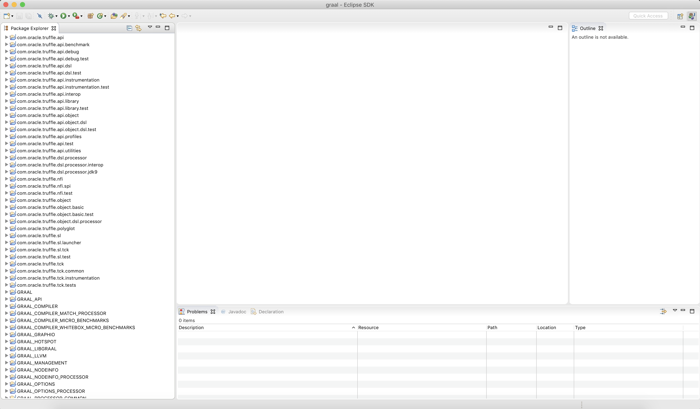

# Understanding How Graal Works - a Java JIT Compiler Written in Java

## What is a JIT compiler?

When you run the javac command, or compile-on-save in your IDE, your Java program is compiled from Java source code into JVM bytecode. This is a binary representation of your Java program. It’s more compact and simpler than the source code. However a conventional processor in your laptop or server can’t actually execute JVM bytecode.

To run your Java program then the JVM interprets the bytecode. Interpreters are often a lot slower than native code running on a real processor, so the JVM at runtime can also run another compiler, this time compiling your bytecode to the machine code that your processor can actually run.
This compiler is usually a lot more sophisticated than the javac compiler, running complex optimisations to produce high quality machine code.


## Why write a JIT compiler in Java?

The OpenJDK implementation of the JVM contains two conventional JIT-compilers today. The client compiler, also called **C1**, is designed to run more quickly and produce less optimised code. The server compiler, also called opto, or **C2**, is designed to take a little more time to run but to produce better optimised code.

The idea was that the client compiler was better for desktop applications, where longer pauses for JIT-compilation are annoying, and the server compiler was better for long-running server applications which can spend more time on compilation.

Today they can be combined, so that code is compiled with C1 first and then C2 later if they are still being executed a lot and it looks worth spending the extra time. This is called **tiered** compilation.

Let’s focus on C2 - that was the server compiler which optimises more.

First of all, C2 is written in C++. There’s of course nothing inherently wrong with C++, but it does have issues. C++ is an unsafe language - meaning that errors in C++ can cause the VM to crash. It’s probably also just the age of the code, but the C++ code in C2 has become very hard to maintain and extend.

You may think but how is it possible to write something like a JIT-compiler in Java? You may think that this could only be possible in a low level systems language like C++...

A JIT-compiler just needs to be able to accept JVM bytecode and produce machine code - you give it a byte[] in and you want a byte[] back!

## Setting up Graal

The first thing we need is Java 9 or greather. The interface that Graal uses, called JVMCI, was added to Java as JEP 243 Java-Level JVM Compiler Interface, and the first version to have this was Java 9

```
$ export JAVA_HOME=`pwd`/jdk11
$ export PATH=$JAVA_HOME/bin:$PATH
$ java -version
java version "11.0.3" 2019-04-16 LTS
Java(TM) SE Runtime Environment 18.9 (build 11.0.3+12-LTS)
Java HotSpot(TM) 64-Bit Server VM 18.9 (build 11.0.3+12-LTS, mixed mode, sharing)
```

```
$ git clone https://github.com/graalvm/mx.git 
$ export PATH=`pwd`/mx:$PATH
```

```
$ git clone https://github.com/graalvm/graal.git 
```

```
$ cd graal/compiler
$ mx build
```

Download Eclipse 4.7.3a ("Oxygen") from http://download.eclipse.org/eclipse/downloads/

For info about how to setup Eclipse please refer to [Oracle's docs](https://github.com/oracle/graal/blob/master/compiler/docs/IDEs.md)

```
$ mx eclipseinit
...
----------------------------------------------
Ensure that there are Installed JREs with these exact names in Eclipse (Preferences -> Java -> Installed JREs):
  jdk-11
You can set the "JRE name" field for a JDK when initially adding it or later with the "Edit..." button.
See https://help.eclipse.org/photon/topic/org.eclipse.jdt.doc.user/tasks/task-add_new_jre.htm on how to add
a new JDK to Eclipse. Be sure to select "Standard VM" (even on macOS) for the JRE type.
----------------------------------------------
```

You will want to open the your preferred directory as workspace, then do File, Import…, General, Existing projects and select the cloned **graal** directory.



You now have all the Graal project opened into the workspace.

Ok now that we have everything ready, let’s show this working. We’ll use this very simple [code](Demo/src/main/java/it/sunnyvale/academy/jsenewfeatures/javajit/Demo.java).

We’ll compile that with javac, and then we’ll run the JVM. First of all I’ll show you the conventional C2 JIT-compiler working.

```
$ javac Demo/src/main/java/it/sunnyvale/academy/jsenewfeatures/javajit/Demo.java -d Demo/target/classes

$ java \
  -XX:+PrintCompilation \
  -cp ./Demo/target/classes \
  -XX:CompileOnly=it.sunnyvale.academy.jsenewfeatures.javajit.Demo::workload \
  it.sunnyvale.academy.jsenewfeatures.javajit.Demo
...
    591    2       1       it.sunnyvale.academy.jsenewfeatures.javajit.Demo::workload (4 bytes)
...
```

Now we’re going to use the Graal that we just built as our JIT-compiler in our Java 11 JVM. We need to add some more complicated flags here.

```
$ java \
  -cp ./Demo/target/classes \
  --module-path=./graal/sdk/mxbuild/dists/jdk11/graal-sdk.jar:./graal/truffle/mxbuild/dists/jdk11/truffle-api.jar \
  --upgrade-module-path=graal/compiler/mxbuild/dists/jdk11/graal.jar \
  --patch-module=jdk.internal.vm.compiler=.jar \
  -XX:+UnlockExperimentalVMOptions \
  -XX:+EnableJVMCI \
  -XX:+UseJVMCICompiler \
  -XX:-TieredCompilation \
  -XX:+PrintCompilation \
  -XX:CompileOnly=it.sunnyvale.academy.jsenewfeatures.javajit.Demo::workload \
  it.sunnyvale.academy.jsenewfeatures.javajit.Demo
...
        374   35             it.sunnyvale.academy.jsenewfeatures.javajit.Demo::workload (4 bytes)
...
Denis compilation
...
```


```
```