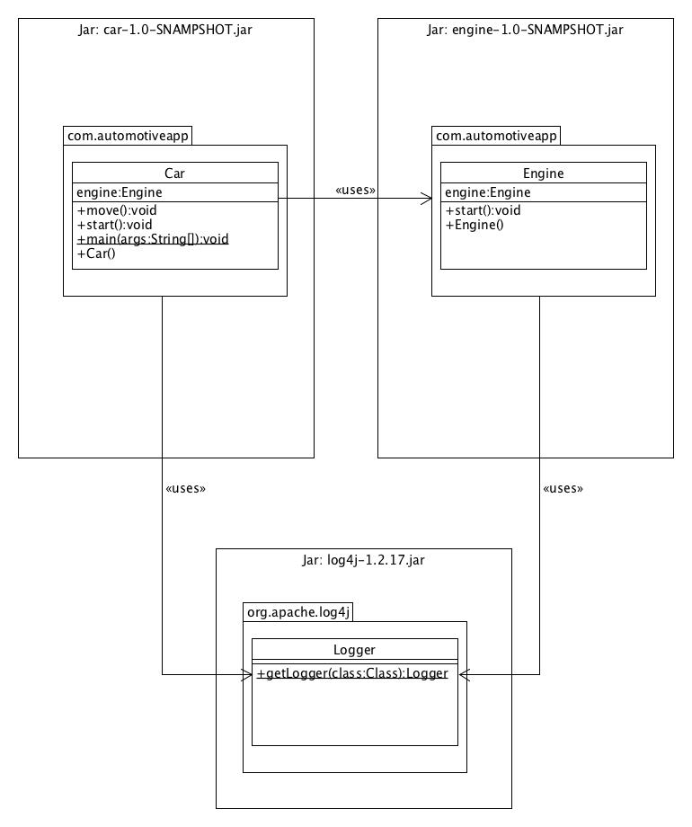

# Java SE 9 labs

## Java Modularity (a.k.a Project Jigsaw)

### The ModularProject application

Implement the ModularProject application following this UML class diagram

### Modularize the [AutomotiveApp](AutomotiveApp/README.md) project

You will have to resolve:

- refactor application libraries to avoid split packages
- migrate application libraries to modules
- address application modules dependencies 
- address dependency to a non-modular jar (log4j-1.2.17.jar)

Try both top-down and bottom-up strategies