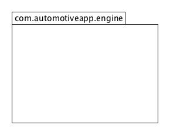

# AutomotiveApp migration solution


Every path is relative from here (where this README.md is located)

## Dependency resolution

Prerequite steps

```
~$ export JAVA_HOME=/path/to/jdk9
~$ export PATH=$JAVA_HOME/bin:$PATH
~$ cd ../../AutomotiveApp
```

To build and install the JARs
```
AutomotiveApp$ mvn clean
AutomotiveApp$ mvn package
AutomotiveApp$ mvn install
```

Describing jars
```
$ jar --file ~/.m2/repository/AutomotiveApp/car/1.0-SNAPSHOT/car-1.0-SNAPSHOT.jar --describe-module                                                                                                 
    No module descriptor found. Derived automatic module.

    car@1.0-SNAPSHOT automatic
    requires java.base mandated
    contains com.automotiveapp

$ jar --file ~/.m2/repository/AutomotiveApp/engine/1.0-SNAPSHOT/engine-1.0-SNAPSHOT.jar --describe-module                                                                                             
    No module descriptor found. Derived automatic module.

    engine@1.0-SNAPSHOT automatic
    requires java.base mandated
    contains com.automotiveapp

$ jar --file  ~/.m2/repository/log4j/log4j/1.2.17/log4j-1.2.17.jar --describe-module                                               
No module descriptor found. Derived automatic module.

log4j@1.2.17 automatic
requires java.base mandated
contains org.apache.log4j
contains org.apache.log4j.chainsaw
contains org.apache.log4j.config
contains org.apache.log4j.helpers
contains org.apache.log4j.jdbc
contains org.apache.log4j.jmx
contains org.apache.log4j.lf5
contains org.apache.log4j.lf5.util
contains org.apache.log4j.lf5.viewer
contains org.apache.log4j.lf5.viewer.categoryexplorer
contains org.apache.log4j.lf5.viewer.configure
contains org.apache.log4j.net
contains org.apache.log4j.nt
contains org.apache.log4j.or
contains org.apache.log4j.or.jms
contains org.apache.log4j.or.sax
contains org.apache.log4j.pattern
contains org.apache.log4j.rewrite
contains org.apache.log4j.spi
contains org.apache.log4j.varia
contains org.apache.log4j.xml
```

Use jdeps to track dependencies
```
$ jdeps -s ~/.m2/repository/AutomotiveApp/car/1.0-SNAPSHOT/car-1.0-SNAPSHOT.jar ~/.m2/repository/AutomotiveApp/engine/1.0-SNAPSHOT/engine-1.0-SNAPSHOT.jar  ~/.m2/repository/log4j/log4j/1.2.17/log4j-1.2.17.jar  
    car-1.0-SNAPSHOT.jar -> java.base
    car-1.0-SNAPSHOT.jar -> /Users/denismaggiorotto/.m2/repository/log4j/log4j/1.2.17/log4j-1.2.17.jar
    engine-1.0-SNAPSHOT.jar -> java.base
    engine-1.0-SNAPSHOT.jar -> /Users/denismaggiorotto/.m2/repository/log4j/log4j/1.2.17/log4j-1.2.17.jar
    log4j-1.2.17.jar -> java.base
    log4j-1.2.17.jar -> java.desktop
    log4j-1.2.17.jar -> java.management
    log4j-1.2.17.jar -> java.naming
    log4j-1.2.17.jar -> java.sql
    log4j-1.2.17.jar -> java.xml
```

## Migration

Running everything in the CLASSPATH
```
 $ java --class-path "$HOME/.m2/repository/AutomotiveApp/car/1.0-SNAPSHOT/car-1.0-SNAPSHOT.jar:$HOME/.m2/repository/AutomotiveApp/engine/1.0-SNAPSHOT/engine-1.0-SNAPSHOT.jar:$HOME/.m2/repository/log4j/log4j/1.2.17/log4j-1.2.17.jar"  com.automotiveapp.Car
    Engine starting...
```

Running everything in the MODULEPATH (split packages must me fixed with --patch-module car=$HOME/.m2/repository/AutomotiveApp/engine/1.0-SNAPSHOT/engine-1.0-SNAPSHOT.jar)

Trying using split packages:
```
$ java  --module-path "$HOME/.m2/repository/AutomotiveApp/car/1.0-SNAPSHOT/car-1.0-SNAPSHOT.jar:$HOME/.m2/repository/AutomotiveApp/engine/1.0-SNAPSHOT/engine-1.0-SNAPSHOT.jar:$HOME/.m2/repository/log4j/log4j/1.2.17/log4j-1.2.17.jar" --module car/com.automotiveapp.Car

    Error occurred during initialization of boot layer
    java.lang.module.ResolutionException: Module engine contains package com.automotiveapp, module car exports package com.automotiveapp to engine
```

Fix split packages with --patch-module car=$HOME/.m2/repository/AutomotiveApp/engine/1.0-SNAPSHOT/engine-1.0-SNAPSHOT.jar
```
$ java --patch-module car=$HOME/.m2/repository/AutomotiveApp/engine/1.0-SNAPSHOT/engine-1.0-SNAPSHOT.jar --module-path "$HOME/.m2/repository/AutomotiveApp/car/1.0-SNAPSHOT/car-1.0-SNAPSHOT.jar:$HOME/.m2/repository/log4j/log4j/1.2.17/log4j-1.2.17.jar" --module car/com.automotiveapp.Car
    Engine starting...
```

## Run the fully migrated AutomotiveModularApp (log4j-1.2.17.jar still loaded as an automatic module)



Prerequite steps

```
~$ export JAVA_HOME=/path/to/jdk9
~$ export PATH=$JAVA_HOME/bin:$PATH
```

Every path is relative from here (where this README.md is located)

To build and install the JARs
```
AutomotiveModularApp$ mvn clean
AutomotiveModularApp$ mvn package
AutomotiveModularApp$ mvn install
```

To run the application
```
AutomotiveModularApp$ cd car
car$ mvn exec:exec
```
